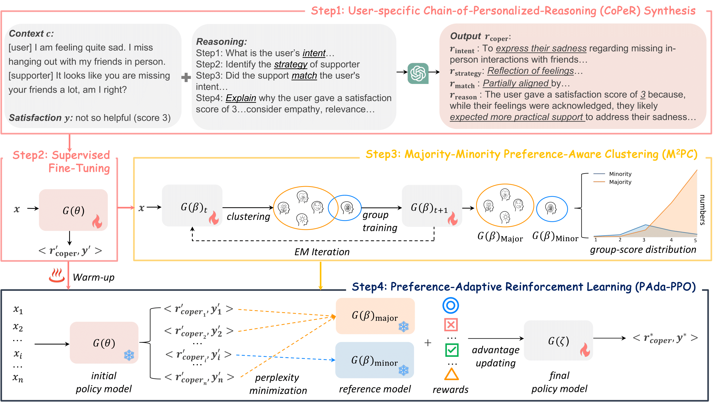

[](https://arxiv.org/abs/2511.05407)
[](https://2025.aacl-ijcnlp.org/)

Official implementation of "[Minority-Aware Satisfaction Estimation in Dialogue Systems via Preference-Adaptive Reinforcement Learning](https://arxiv.org/abs/2511.05407)" accepted at AACL-IJCNLP 2025 (Main Conference).

Authors: Yahui Fu, Zi Haur Pang, Tatsuya Kawahara

### Abstract

User satisfaction in dialogue systems is inherently subjective. When the same response strategy is applied across users, minority users may assign different satisfaction ratings than majority users due to variations in individual intents and preferences. However, existing alignment methods typically train one-size-fits-all models that aim for broad consensus, often overlooking minority perspectives and user-specific adaptation. 

We propose a unified framework that models both individual- and group-level preferences for user satisfaction estimation through three key components:
- **CoPeR** (Chain-of-Personalized-Reasoning): Captures individual preferences via interpretable reasoning chains.
- **M²PC** (Majority-Minority Preference-Aware Clustering): Discovers distinct user groups in an unsupervised manner to learn group-level preferences.
- **PAda-PPO** (Preference-Adaptive PPO): Jointly optimizes alignment with both individual and group preferences.

Experiments on the Emotional Support Conversation dataset demonstrate consistent improvements, particularly for underrepresented user groups.

### Model Architecture

<div align="center">
  
</div>

### Installation
```bash
git clone https://github.com/fuyahuii/minority-aware-se.git
cd minority-aware-se

conda create -n mase python=3.10 -y
conda activate mase

pip install -r requirements.txt
```

### Training Pipeline

Our approach follows a four-stage training pipeline: **CoPeR → SFT → M²PC → PAda-PPO**

#### 1. Chain-of-Personalized-Reasoning (CoPeR)

Synthesize personalized reasoning chains:
```bash
python synthesis_reasoning.py
```

#### 2. Supervised Fine-Tuning (SFT)

Train the model with the CoPeR prompt:
```bash
bash scripts/sft/coper.sh
```

Inference and evaluation:
```bash
python inference/eval_sft_coper.py
```

#### 3. Majority-Minority Preference-Aware Clustering (M²PC)

Discover user groups via EM-based clustering:
```bash
python m2pc.py
```

#### 4. Preference-Adaptive Reinforcement Learning (PAda-PPO)

Train with preference-adaptive PPO:

<!--
```bash
bash scripts/rl_base/base_train.sh
```
```bash
bash scripts/rl_ucot/ucot_train.sh
```
-->
```bash
bash scripts/rl_coper/coper_train.sh
```

Inference and evaluation:

<!--
```bash
bash scripts/rl_base/base_infer.sh 
```
```bash
bash scripts/rl_ucot/ucot_infer.sh
```
-->
```bash
bash scripts/rl_coper/coper_infer.sh
```

### **Citation**
If you find this repository or paper useful, please kindly cite our paper:
```
@article{fu2025minority,
  title={Minority-Aware Satisfaction Estimation in Dialogue Systems via Preference-Adaptive Reinforcement Learning},
  author={Fu, Yahui and Pang, Zi Haur and Kawahara, Tatsuya},
  journal={arXiv preprint arXiv:2511.05407},
  year={2025}
}
```
### **Contact**
For any questions related to the paper or this repository, feel free to contact Yahui Fu at [fu.yahuiii@gmail.com](mailto:fu.yahuiii@gmail.com).